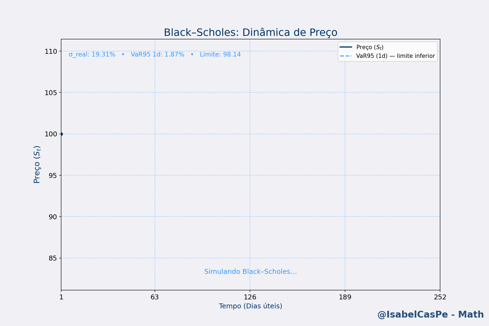
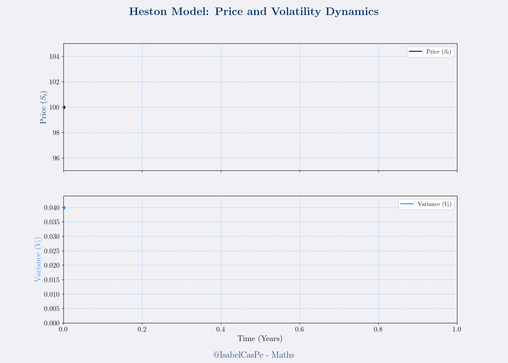
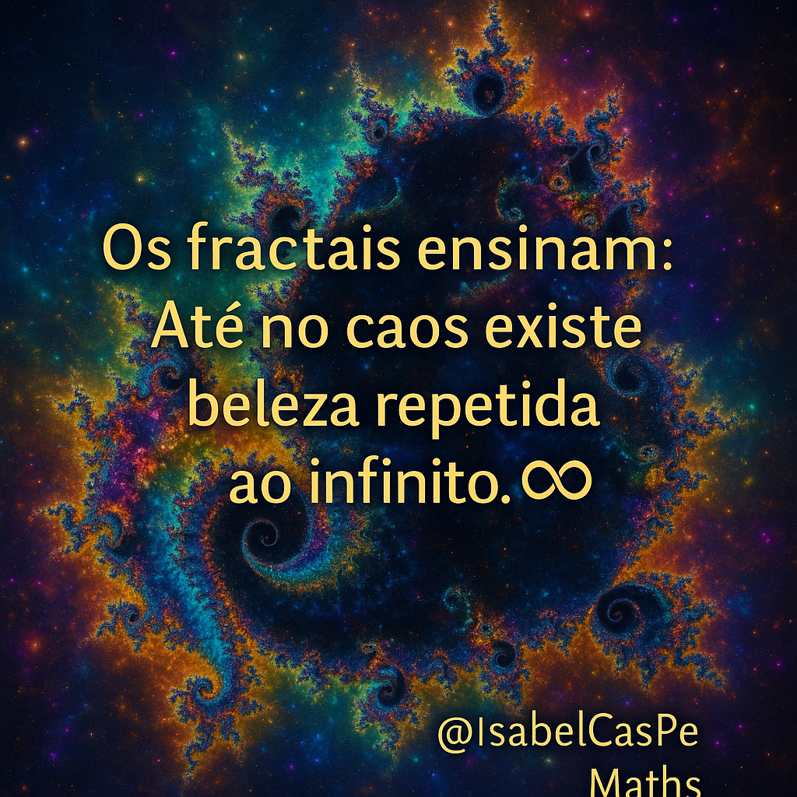
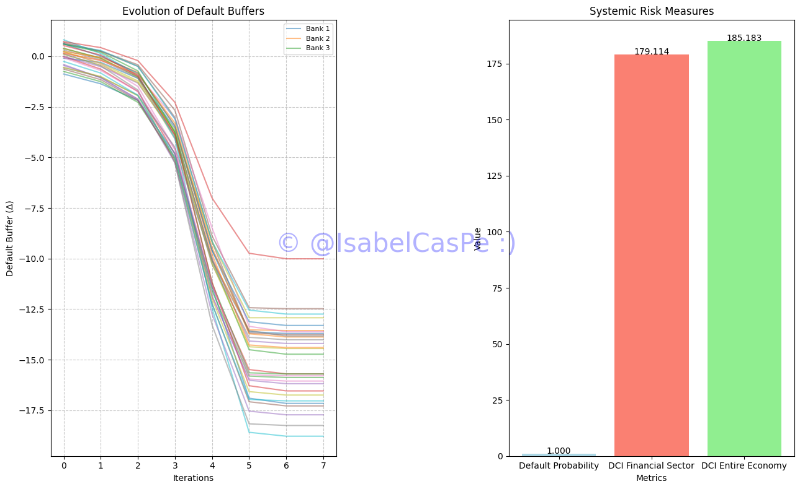
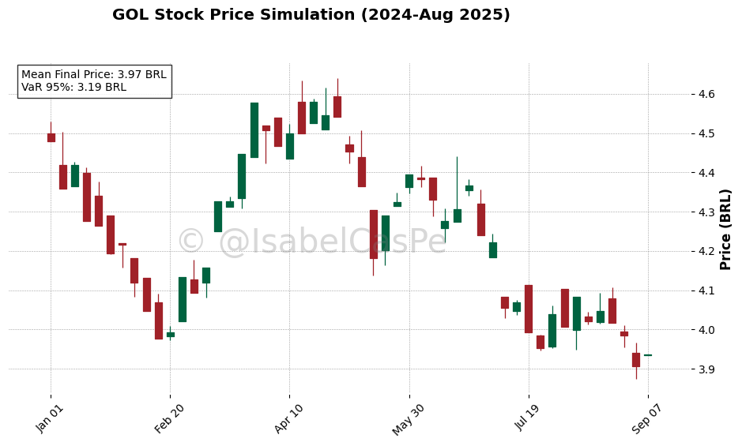
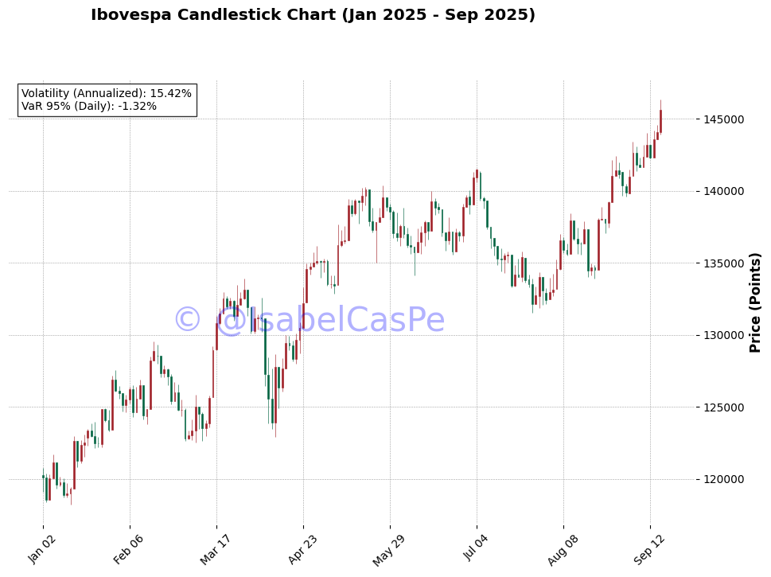

<!-- HERO -->
# Applied Mathematics 💎

  

**PT · EN · ES** · [Galeria](#galeria--gifs) · [Instalação](#instalação--installation--instalación) · [Apache License 2.0](#licença--license--licencia)

---
## Repositório: Prof. Ana Isabel Castillo Pereda

Bem-vindo ao meu repositório dedicado a artigos acadêmicos e trabalhos inovadores nas áreas de **matemática aplicada**, **risco sistêmico**, **simulações estocásticas** e **finanças quânticas**. Este espaço reúne minhas publicações e projetos autoriais, como as dinâmicas quânticas aplicadas ao Bitcoin (BTC), todos disponíveis para exploração e inspiração.

---

## Master's Dissertation : Automação de diagnóstico para ensaios não destrutivos magnéticos. By. @IsabelCasPe. 😎 

---

## Artigos e Trabalhos

## Geopolitical Shocks, BRICS Expansion, and Systemic Risk: A Network-Based Perspective on Strategic Disruptions
- **Arquivo**: [A Network-Base](AnaliseAtual.pdf)
- **Data de Upload** 04/01/2026
- **Abstract** : Recent geopolitical interventions in Latin America reveal how strategic political actions, particularly when timed around international diplomatic agreements, can act as exogenous shocks capable of amplifying systemic risk. This short paper connects contemporary events to historical patterns of intervention and containment, highlighting their relevance within network-based models of contagion, default cascades, and institutional fragility. Special attention is given to the role of the BRICS bloc and the growing multipolar structure of the global economy.

### Dinâmicas Quânticas Aplicadas ao BTC
- **Arquivo**: [DinamicasQF.pdf](DinamicasQF.pdf)
- **Data de Upload**: 29/06/2025
- **Resumo**: Este trabalho explora uma abordagem inovadora para modelagem financeira baseada em dinâmicas quânticas, focada em simulações dinâmicas do Bitcoin (BTC-USD). Transformamos dados estáticos em animações interativas usando Python, integrando conceitos como média móvel (\( M_t = \frac{1}{20} \sum_{i=t-19}^{t} P_i \)) e volatilidade estocástica (\( \sigma = \sqrt{\frac{1}{n} \sum_{i=1}^{n} (r_i - \bar{r})^2} \)). Os resultados mostram que o modelo supera estratégias tradicionais, oferecendo ferramentas visuais para investidores gerenciarem riscos em mercados voláteis.
- **Técnicas**: Simulações dinâmicas, animações com Matplotlib e mplcyberpunk, modelagem estocástica.
- **Vídeo Associado**: [btc.mp4](btc.mp4) - Confira a animação com efeitos futuristas.
- **Status**: Trabalho autoral, não submetido a journals, disponível para feedback e estudo.
---
# ## 🎓 Produção Acadêmica
Repositório dedicado aos artigos acadêmicos publicados por Ana Isabel Castillo Pereda nas áreas de matemática aplicada, risco sistêmico e simulações estocásticas.

##  Risk Measures, Systemic Risk, and Default Cascades in Global Equity Markets

📌 *Publicado em:* Quantitative Finance and Economics (QFE) — submissão em avaliação  
📝 *Resumo:* Este artigo propõe uma extensão do modelo de Gai-Kapadia para simular falhas em redes de ativos globais, com foco em medidas de risco como VaR e CVaR, aplicadas a 20 ativos (Brasil e internacional).  
🔗 [Acesse o artigo completo no arXiv](https://arxiv.org/pdf/2504.01969v2)  
📊 *Técnicas:* Simulações de Monte Carlo, análise de rede, medidas de risco

---

### 🚧 **Papers em Construção** 🚧  

  
  
  
  
  

  
  
  
  
  

---

## Dynamics 
- 
Simulação GBM (Black–Scholes) com retornos log, vol realizada e VaR95 1d (linha limite) no eixo de dias úteis.

- 
Anima 4 trajetórias GBM (Black–Scholes) em dias úteis, com **VaR95 1d** por curva (linha tracejada) e **rótulos dinâmicos** no ponto atual.

-  Simulação do Modelo Heston: Dinâmica de Preço (S_t) e Volatilidade (V_t) ao longo de 252 dias. Inclui análise de risco com Volatilidade Implícita e VaR 95%.

---
## Galeria de Padrões e códigos. ©IsabelCasPe.💙 © 2025. All figures are under MIT license Use with attribution. 
- 
- 
-  : Simulação de preços com velas.
-   
---
## Contato
- **Email**: [anacp20@gmail.com](mailto:anacp20@gmail.com)
- **GitHub**: [@IsabelCasPe](https://github.com/IsabelCasPe)
---
## Licença
- Códigos Python: [Apache License 2.0](LICENSE)

---
> ✨ "A matemática vibra quando ensinada com beleza e aplicada com alma."  
> **© 2025 - Prof. Ana Isabel Castillo** 💙
---
